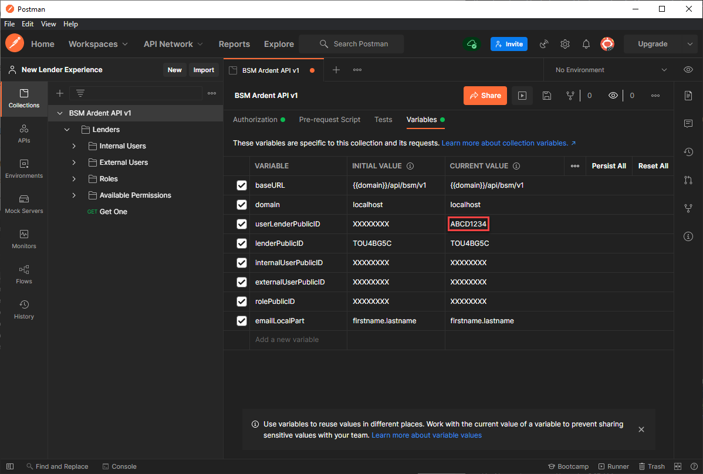

# Guide

## Test with Postman
Although **Ardent** only allows [Session-Based Authentication](/ardent-api/learn/introduction/#session-based-authentication) at the moment, it's possible (and recommended) to test and develop locally using Postman.

::: tip Localhost Only
It is currently only possible to interact with **Ardent** via HTTP clients like Postman on localhost. This does not work on remote environments (and there are guards in place that will prevent access on remote environments).
:::

### Prerequisites
- Have Postman v8.x or newer installed (although this will probably work fine with older versions).
- Be on a `besmartee_dev` branch that has v2.80 code or newer.
  - Reminder: Be sure to run `composer install` and run all migrations.
- Have the Public ID / Lender ID of a Lender you'd like to test with.
- Have the Public ID / User ID of a UserLender in the Lender that you'd like to test with.
    - Note: This will be the UserLender that you will be authenticated as when performing API Requests. Therefore, it's recommended that you select a UserLender that has all / most of the available permissions.

### Steps
- Find the postman.json file in the `besmartee_dev` code repository within the folder of the appropriate Ardent version. For example, the postman collection Ardent version 1 can be found at `resources/api/bsm/v1/postman.json`.
- In Postman, click on the Import button, which can be found near the top left of the Postman window.
- Within the import modal, either upload postman.json to the 'File' tab or paste the contents of postman.json to the 'Raw text' tab.
  - Note: If you already have a Postman collection for Ardent, you will be asked if you want to replace the existing collection. Doing so will delete the current values of your variables, so you may wish to make back-ups at this time.
- Open the Collection and view the Variables tab. Enter a value for `userLenderPublicID` as a CURRENT VALUE. Use the Public ID / User ID of a UserLender that you'd like to authenticate all requests as.
  - Note: The collection assumes that this authenticated user belongs to the Smart Mortgage lender (`lenderPublicID: TOU4BG5C`). If this is not true, set the CURRENT VALUE of `lenderPublicID` accordingly.



Use `BSM Ardent API v1 / Lenders / Get One` to test your ability to retrieve basic data for a single lender. Send the GET request and you should observe a 200 OK Response with a JSON payload in the body that contains information about the lender.

## Create a new Resource
- In the **resources/api/bsm/v1** folder, identify where your new Resource Endpoint will be located. Create the required folder(s) if they do not exist.
    - For example, if you were looking to make a **/lenders/internal-users/favorite-colors** endpoint, then you would want to make sure a **/Lender/InternalUser/FavoriteColor** folder exists.
- In the folder that will contain your new Resource Endpoint, create the following classes ("FavoriteColor" should be replaced with your new Resource's name):
    - FavoriteColor**Controller**.php
    - FavoriteColor**Reader**.php
    - FavoriteColor**Resource**.php
    - FavoriteColor**Updater**.php
    - FavoriteColor**Validator**.php
- Inspect the contents of the **resources/api/bsm/StarterTemplates/v1/Resource** folder. The files here serve as examples / templates for you to follow. Copy and paste the contents of each Example*.php file to the matching classes you created in the previous step.
    - To be specific: You should copy and paste the contents of **ExampleController.php** to **FavoriteColorController.php**. After doing so, you should copy and paste the contents of **ExampleReader.php** to **FavoriteColorReader.php**. And so forth.
- Implement all the **// TODO comments** in your new Resource Endpoint classes.
    - If you don't know which class to implement first, the following order is recommended:
        - Controller
        - Resource
        - Getter
        - Validator (if needed)
        - Updater (if needed)
    - For more detailed instructions on how to implement these classes, see [How to implement the Ardent Base Classes](#how-to-implement-the-ardent-base-classes).
    
## Create a new Procedure
- In the **resources/api/bsm/v1** folder, identify where your new Procedure will be located. Create the required folder(s) if they do not exist.
    - For example, if you were looking to make a **/lenders/internal-users/say-hello** endpoint, then you would want to make sure a **/Lender/InternalUser/SayHello** folder exists.
- In the folder that will contain your new Resource Endpoint, create a SayHello**Procedure**.php class ("SayHello") should be replaced with your new Procedure's name.
- Inspect the contents of the **resources/api/bsm/StarterTemplates/v1/Procedure** folder. The file here serves as an example / template for you to follow. Copy and paste the contents of the **ExampleProcedure.php** file to the class you created in the previous step.
    - For more detailed instructions on how to implement a Procedure, see [How to implement a Procedure](#how-to-implement-a-procedure).
    
## Implement the Ardent Base Classes
When creating or updating an Endpoint, you'll have to implement a specific pattern of constants and methods in one of the available **Ardent Base** classes. This section will help you with the specifics of implementing each class.

### Implement a Controller

#### Class
Controllers must extend the `BeSmartee\ArdentAPI\BaseController` abstract class.

#### Naming Pattern
Controllers must have a class name and file name in the pattern of `{Name}Controller` where `{Name}` is the name of the Resource (e.g. "LenderController", "InternalUserController").

#### Resource Key Constant
Controllers must define their own `RESOURCE_KEY` class constant that is a unique PascalCase string.

#### Constructor
Controllers should have a constructor like the following to ensure correct behavior in **Ardent**:

```php
public function __construct(ArdentRequest $request, array $relatedControllers = [])
{
    parent::__construct($request, $relatedControllers);
}
```

#### Implement `getResourceKeysOfRequiredControllers()`
Controllers must provide the Resource Keys of any Required Controllers they may need.

A Required Controller is a Controller that another Controller depends on to function correctly.

For example, the **Lenders > Internal Users** endpoint is nested within the **Lenders** endpoint. This can be observed by looking at the URL for the endpoint, which is:

```http request
GET /lenders/{id}/internal-users
```

This URL is effectively saying that you cannot access any **Internal Users** without first providing a **Lender**. Accordingly, the **InternalUsersController** class that implements this endpoint has the following implementation of the `getResourceKeysOfRequiredControllers()` method:

```php
public function getResourceKeysOfRequiredControllers(): array {
    return [
        LenderController::RESOURCE_KEY,
    ];
}
```

You'll notice the usage of the `LenderController::RESOURCE_KEY` class constant instead of a string; this is the recommended way to reference the Resource Keys of Controllers in code.

#### Implement `registerToRouter()`
Controllers must register routes to **Ardent's** Router.

Routes can be registered using a fluent interface. As a practical example, the **InternalUserController** class implements the `registerToRouter()` method like so:

```php
public static function registerToRouter(Router $router, string $relativeURI = self::RELATIVE_URI_FOR_ROUTING): void {
    $router->route("/lenders/{id}/internal-users") // Route this URL pattern...
        ->to(self::class) // ...to this class...
        ->withResourceEndpoints([ // ...with these whitelisted endpoints
            ResourceEndpoint::GET_ONE, // Allow one Internal User to be accessed
            ResourceEndpoint::GET_MANY, // Allow many Internal Users to be accessed
            ResourceEndpoint::CREATE, // Allow Internal Users to be created
            ResourceEndpoint::PATCH_ONE, // Allow one Internal User to be edited via the PATCH method
            ResourceEndpoint::PATCH_MANY, // Allow many Internal Users to be edited via the PATCH method
        ]);
    StateLicensingController::registerToRouter($router, $authenticatedUser); // The Internal Users endpoint has a nested State Licensing endpoint, so it delegates the registering to the StateLicensingController class's implementation of this method (i.e. separation of concerns).
}
```

**Ardent** has a **ResourceEndpoint** class that exposes a number of class constants. These class constants can be used in the `Route->withResourceEndpoints()` function to whitelist the allowed aggregate endpoints and methods for a Resource.

To be exact, the full list of class constants and what they allow is:

`CREATE` Allow **POST /** to create a one or many Resources in the Collection 
> Example: **POST /lenders/{id}/internal-users** will create a new Internal User in the Lender

<br>

`GET_ONE` Allow **GET /{id}** to obtain one Resource in the Collection
> Example: **GET /lenders/{id}/internal-users/{id}** will get one Internal User in the Lender

<br>

`GET_MANY` Allow **GET /** to obtain many Resources in the Collection 
> Example: **GET /lenders/{id}/internal-users** will get many Internal Users in the Lender

<br>

`PATCH_ONE` Allow **PATCH /{id}** to edit one Resource in the Collection via the PATCH method
> Example: **PATCH /lenders/{id}/internal-users/{id}** will edit one Internal User in the Lender via the PATCH method

<br>

`PATCH_MANY` Allow **PATCH /** to edit many Resources in the Collection via the PATCH method
> Example: **PATCH /lenders/{id}/internal-users** will edit many Internal Users in the Lender via the PATCH method

<br>

`PUT_ONE` Allow **PUT /{id}** to edit one Resource in the Collection via the PUT method
> Example: **PUT /lenders/{id}/internal-users/{id}** will edit one Internal User in the Lender via the PUT method

<br>

`PUT_MANY` Allow **PUT /** to edit many Resources in the Collection via the PUT method
> Example: **PUT /lenders/{id}/internal-users** will edit many Internal Users in the Lender via the PUT method

<br>

`DELETE_ONE` Allow **DELETE /{id}** to edit one Resource in the Collection via the DELETE method
> Example: **DELETE /lenders/{id}/internal-users/{id}** will delete one Internal User in the Lender

<br>

`DELETE_MANY` Allow **DELETE /** to edit many Resources in the Collection via the DELETE method
> Example: **DELETE /lenders/{id}/internal-users** will delete many Internal Users in the Lender

##### Registering Nested Resources
It's often the case that Resources will be nested within each other.

For example, the **Lender** Resource has **Internal User**, **External User**, and **Branch** (among many other Resources) nested within it.

To register these **Nested Resources**, you will need to call a **Nested Resource's** `registerToRouter()` function in the **Nested Resource's** parent Resource.

This is best shown through the **Lender** Resource, which is a parent Resource for all of its many **Nested Resources**. It expresses this relationship in `LenderController::registerToRouter()` like so:

```php 
public static function registerToRouter(Router $router, string $relativeURI = self::RELATIVE_URI_FOR_ROUTING): void {
    $router->route("/lenders")
        ->to(self::class)
        ->withResourceEndpoints([
            ResourceEndpoint::GET_ONE,
        ]);

    // All of these are Nested Resources (children) of the Lenders Resource.
    BranchController::registerToRouter($router, $authenticatedUser);
    CampaignController::registerToRouter($router, $authenticatedUser);
    InternalUserController::registerToRouter($router, $authenticatedUser);
    RoleController::registerToRouter($router, $authenticatedUser);
    TeamController::registerToRouter($router, $authenticatedUser);
    LeadSourceController::registerToRouter($router, $authenticatedUser);
}
```

And as another example: the **Internal User** Resource (which is a child of **Lender**) has a **State Licensing** Resource nested within it. It expresses this relationship in `InternalUserController::registerToRouter()` like so:

```php 
public static function registerToRouter(Router $router, string $relativeURI = self::RELATIVE_URI_FOR_ROUTING): void {
    $router->route("/lenders/{id}/internal-users")
        ->to(self::class)
        ->withResourceEndpoints([
            ResourceEndpoint::GET_ONE,
            ResourceEndpoint::GET_MANY,
            ResourceEndpoint::CREATE,
            ResourceEndpoint::PATCH_ONE,
            ResourceEndpoint::PATCH_MANY,
        ]);
    // An Internal User can have State Licensing, so State Licensing is considered a Nested Resource (child) of Internal Users.
    StateLicensingController::registerToRouter($router, $authenticatedUser);
}
```

#### Implement `determineAccessControl()`
Controllers must define the Access Control Policy for the Resource that they control.

To do this, it's important to know that **Ardent** enforces Access Control Policies through an internal Permission system. Every **Controller** has a **Permission Set** that stores **Permissions** in a key-value system. A **Permission** is an object that tracks CRUD (Create, Read, Update, Delete) permissions for a specific dataset.

To demonstrate how to implement the `determineAccessControl()` method, let's take a look at how the **InternalUserController** class does it:

```php
protected function determineAccessControl(): void {
    $this->definePermission(self::PERMISSION_ADMIN_FIELDS); // Internal Users can have sensitive fields (like passwords) in their model, so the Internal Users resource defines a new permission with a specified key ("Admin Fields" in this case). This Permission can be referenced later by other Models to enforce the Access Control Policy.

    $this->determineAccessControlForUserLender();
    $this->determineAccessControlForUserAdmin();
}

protected function determineAccessControlForUserLender(): void {
    $request = $this->getRequest();
    $authenticatedUser = $request->getAuthenticatedUser();
    $resourceKey = $this->getResourceKey();

    if (!$authenticatedUser instanceof UserLender) return; // Only issue the following access control policy for UserLenders

    $this->getPermission($resourceKey)->allowRead(); // By default, allow read access for this Resource (Internal Users)
    if ($authenticatedUser->hasPageVisitPermission("AdminUsers")) { // If you can view the "Admin Users" page in our legacy system. Note: Our BSM Roles & Permissions system often correlates closely with what Ardent is concerned with, so a lot of Ardent Permissions can be derived from it.
        $this->getPermission($resourceKey)->allowAll(); // Allow full access to the basic fields in Internal Users.
        $this->getPermission(self::PERMISSION_ADMIN_FIELDS)->allowAll(); // Allow full access to the Admin-only fields in Internal Users.
    }
}

protected function determineAccessControlForUserAdmin(): void {
    $resourceKey = $this->getResourceKey();

    if (!$this->getRequest()->getAuthenticatedUser() instanceof UserAdmin) return; // Only issue the following access control policy for UserAdmins

    $this->getPermission($resourceKey)->allowRead(); // BSM Admins can only read basic Internal User data (for now).
}
```

There's quite a bit going on, but the gist of it is:
- Only UserLenders and UserAdmins can access the Internal Users resource
- UserLenders can always read the Internal User resource.
    - If a UserLender has the appropriate Page Visit Permission ("AdminUsers"), then they can fully access the non-Admin fields in the Internal User resource (i.e. can create new Internal Users, read Internal Users, update Internal Users, and delete Internal Users). 
        - Also, they can fully access Admin-only fields.
- UserAdmins can only read the Internal User resource.

### Implement a Resource
#### Class
Readers must extend the `BeSmartee\ArdentAPI\BaseResource` abstract class.

#### Naming Pattern
Readers must have a class name and file name in the pattern of `{Name}Resource` where `{Name}` is the name of the Resource (e.g. "LenderResource", "InternalUserResource").

#### `$controller` PHPDoc comment
It's highly recommended that you redefine the `$controller` property with a PHPDoc @var comment such that the type matches the class name of the Resource's Controller. This will help with type-hinting when using the `$controller` property in your Resource class.

For example, the **BranchResource** class does the following redeclaration:
```php
/** @var BranchController */
protected $controller;
```

#### Constructor
Resources should have a constructor that implements their parent BaseResource constructor.

As an example, observe how the **BranchResource** class implements its constructor:

```php 
public function __construct(BranchController $controller) {
    parent::__construct($controller, "lenders_branches as lb", LenderBranch::getSelectQuery(true));
}
```

You'll notice that there are three parameters in the parent BaseResource constructor. In order, they are:
- **$controller** the Resource Controller (**BranchController** in this case)
- **$tableAsJoinSQL** SQL that defines the Resource's table and JOIN-as name. Alternate example with Lenders: "lenders as l"
- **$selectQueryWithJoin** The base SELECT SQL to interact with the target Resource's table. This must be JOIN compatible.
    - Note: A couple of classes already expose JOIN-compatible SELECT SQL getters, such as `Lender::getSelectQuery()`. If one does not exist in your Resource's associated BSM Library Class, then create one using the `Helper::replaceGetSelectQuerySQLWithJoinSQL()` function.
    
#### Implement `defineSortableFieldTableMappings()`
**Ardent** will automatically append "ORDER BY `x` ASC|DESC" statements when fetching Resources. The `defineSortableFieldTableMappings()` method provides a mapping so that **Ardent** can translate requests from the client and substitute `x` for the right table + column at run-time.

The **BranchResource** class implements this method like so:

```php 
protected function defineSortableFieldTableMappings(): array {
   return [
       "name" => "lb.name", // Note: the first filter is always used by default
       "id" => "lb.id",
   ];
}
```

This means that clients can add a `?sort=name` or `?sort=id` query parameter to their requests when accessing the Branch resource, which will cause the returned Branches to be sorted by their name or ID (respectively).

:::tip
The first provided sort mapping will be used by default on all requests.
:::

##### Order (ASC and DESC)

By default, **Ardent** will sort in Ascending order, but it can interpret Descending order requests with the `?order=desc` query parameter.

#### Implement `defineFilters()`
**Ardent** can listen for filters in GET queries, which can then be implemented in the [`handleFilters()`](#implement-handlefilters) function.

The **BranchResource** class implements this method like so:

```php 
protected function defineFilters(): array {
    return [
        "ids",
        "internalUserID",
    ];
}
```

This means that clients can add `?ids=ABCD1234,WXYZ7890` and `?internalUserID=ABCD1234` query parameters when accessing the Branch resource, which will filter the returned Branches by specific IDs or Branches to which an Internal User is assigned.

::: tip The "ids" filter is required
You must define an **"ids"** filter on all Resources. **Ardent** will use the **ids** filter internally to access Resources as needed when processing endpoints. If a Resource does not have an **ids** filter defined, it will behave incorrectly when handling Resources and result in fatal errors.
:::

Note: It's possible for many filters to be used at once.

#### Implement `handleFilters()`
**Ardent** will check a request's query parameters against the list of filters defined in the [`defineFilters()`](#implement-definefilters) function. All filters that were found in the request's query parameters will be returned and provided to the `handleFilters()` function as an array. The goal of this function is to implement the logic required to handle the matched filters.

The **BranchResource** class implements this method like so:
```php 
protected function handleFilters(array $filters): void {
    $authenticatedUser = $this->authenticatedUser;
    foreach($filters as $filter) {
        switch ($filter) {
            case "ids":
                $publicIDs = self::getPublicIDsFromQueryInSQLFormat();
                $this->appendToWHERESQL("AND lb.publicID IN ($publicIDs)");
                break;
            case "internalUserID":
                $this->appendToJOINSQL("JOIN users_lenders_branches as ulb ON (ulb.deletedAt IS NULL AND ulb.userLenderID = (SELECT id FROM users_lenders WHERE userID = :userLenderPublicID))");
                $this->addPDOBinding(":userLenderPublicID", $this->requestQuery["internalUserID"], PDO::PARAM_STR);
                $this->appendToWHERESQL("AND lb.id = ulb.lenderBranchID");
                break;
            case "lenderID":
                if ($authenticatedUser instanceof UserAdmin) {
                    $this->appendToWHERESQL("lb.lenderID = :lenderID");
                    $this->addPDOBinding(":lenderID", $this->requestQuery["lenderID"], PDO::PARAM_INT);
                }
                break;
            default:
                break;
        }
    }
}
```

More documentation on how to use the SQL methods (e.g. appendToWhereSQL() and appendToJOINSQL()) will be added in the documentation for the Model Resource (coming soon).

#### Implement `setAccessControl()`
Resources must set Access Control SQL limiters to prevent unauthorized access of data.

The **BranchResource** class implements this method like so:
```php 
protected function setAccessControl(): void {
    $authenticatedUser = $this->authenticatedUser;
    $lender = $this->controller->getLender();

    if ($authenticatedUser instanceof UserLender) {
        if ($authenticatedUser->lenderID === $lender->id) {
            $this->setBaseWHERESQL("WHERE lb.lenderID = :lenderID AND lb.isActive = 1");
            $this->addPDOBinding(":lenderID", $lender->id, PDO::PARAM_INT);
        } else {
            throw new ResourceIsForbiddenException();
        }
    } elseif ($authenticatedUser instanceof UserAdmin) {
        $this->setBaseWHERESQL("WHERE lb.lenderID = :lenderID AND lb.isActive = 1");
        $this->addPDOBinding(":lenderID", $lender->id, PDO::PARAM_INT);
    } else {
        throw new ResourceIsForbiddenException();
    }
}
```

More documentation on how to use the setBaseWHERESQL() method will be added in the documentation for the Model Resource (coming soon).

#### Implement `instantiateAndReturnResources()`
Resources must instantiate BSM Library Class objects out of the returned SQL rows from a query.

The **BranchResource** class implements this method like so:
```php 
protected function instantiateAndReturnResources(array $sqlRows): array {
    $list = [];
    foreach ($sqlRows as $row) {
        $branch = new LenderBranch($row);
        $list[$branch->publicID] = $branch;
    }
    return $list;
}
```

**Ardent** will take the returned array of classes and make it the Primary Resource for the Controller, which will allow it to be accessed in any of the Model Classes (i.e. Reader, Validator, Reader, etc.).

### Implement a Reader
#### Class
Readers must extend the `BeSmartee\ArdentAPI\BaseReader` abstract class.

#### Naming Pattern
Readers must have a class name and file name in the pattern of `{Name}Reader` where `{Name}` is the name of the Resource (e.g. "LenderReader", "InternalUserReader").

#### `$controller` PHPDoc comment
It's highly recommended that you redefine the `$controller` property with a PHPDoc @var comment such that the type matches the class name of the Resource's Controller. This will help with type-hinting when using the `$controller` property in your Reader class.

For example, the **LenderReader** class does the following redeclaration:
```php
/** @var LenderController */
protected $controller;
```

#### Implement `getJSONRepresentationOfResource()`
Readers must provide the JSON representation of their Resource.

As an example, a simplified version of the **LenderReader** class can implement the `getJSONRepresentationofResource()` method like so:

```php
public function getJSONRepresentationOfResource(): void {
    $lenders = $this->controller->getLenders(); // Get the requested Lenders. Equivalent to array_values($this->controller->getPrimaryResource())
    $data = [];
    foreach ($lenders as $lender) {
        $data[] = [
            "id" => $lender->getPublicID(),
            "name" => $lender->name,
            "isTPO" => (bool) $lender->isTPO,
        ];
    }
    $this->controller->setResponseHttpStatusCode(HttpStatusCode::OK);
    $this->controller->setResponseData($data);
}
```

### Implement a Validator
#### Class
Validators must extend the `BeSmartee\ArdentAPI\BaseValidator` abstract class.

#### Naming Pattern
Validators must have a class name and file name in the pattern of `{Name}Validator` where `{Name}` is the name of the Resource (e.g. "LenderValidator", "InternalUserValidator").

#### `$controller` PHPDoc comment
It's highly recommended that you redefine the `$controller` property with a PHPDoc @var comment such that the type matches the class name of the Resource's Controller. This will help with type-hinting when using the `$controller` property in your Validator class.

For example, the **StateLicensingValidator** class does the following redeclaration:
```php
/** @var StateLicensingController */
protected $controller;
```

#### Ardent's Validation System
**Ardent** provides a **Validation System** to help standardize and simplify the validation of requests. Understanding this **Validation System** will be essential when implementing a Validator.

To best illustrate how **Ardent's Validation System** works, lets use it through a fun example: 

Suppose we need to implement a `/dog-owners` endpoint. Let's say that the JSON representation of a Dog Owner resource is:

```json
{
    "id": "",
    "ownerName": "",
    "numberOfDogs": 0,
    "dogNames": [],
    "likesCats": false
}
```

In the **DogOwnerValidator** class's implementation of the three **BaseValidator** validation methods (validateCreateLogic, validatePatchLogic, validatePutLogic), **Ardent** will expect an array like the following to be returned for each method:

```json
{
    "id": "ABCD1234",
    "ownerName": {
        "validationType": "none",
        "validationMessage": ""
    },
    "numberOfDogs": {
        "validationType": "none",
        "validationMessage": ""
    },
    "dogNames": {
        "validationType": "none",
        "validationMessage": ""
    },
    "likesCats": {
        "validationType": "none",
        "validationMessage": ""
    }
}
```

> Note: It's not important to know why these keys exist at this time, but there will be documentation on what they do later.

To help with constructing that expected array structure, the **BaseValidator** class has a built-in method called `validateFieldByKeyInArray()`, which will return a **FieldValidator** object. The **FieldValidator** object encapsulates field-level validation for **Ardent's Validation System**. It allows us to easily validate common scenarios (i.e. must be a string, must not be empty, etc.) and construct the Validation data array that **Ardent** expects.

This is best understood by seeing how it's used in-code. So, we can implement the `validatePatchLogic()` for our **DogOwnerValidator** class like so:

```php 
protected function validatePatchLogic(): array
{
    $validation = [];
    foreach ($this->resourcesBeingValidated as $resourceData) {
        $validation[] = [
            "id" => $resourceData["id"],
            "ownerName" => $this->validateOwnerName($resourceData),
            "numberOfDogs" => $this->validateNumberOfDogs($resourceData),
            "dogNames" => $this->validateDogNames($resourceData),
            "likesCats" => $this->validateLikesCats($resourceData),
        ];
    }
    return $validation;
}

protected function validateOwnerName(array $data): array {
    return $this->validateFieldByKeyInArray("ownerName", $data)
        ->isRequired()
        ->isNotEmpty()
        ->isString()
        ->buildNode();
}

protected function validateNumberOfDogs(array $data): array {
    return $this->validateFieldByKeyInArray("numberOfDogs", $data)
        ->isRequired()
        ->isNotEmpty()
        ->isInteger()
        ->buildNode();
}

protected function validateDogNames(array $data): array {
    return $this->validateFieldByKeyInArray("dogNames", $data)
        ->isRequired()
        ->isNotEmpty()
        ->isArray()
        ->buildNode();
}

protected function validateLikesCats(array $data): array {
    return $this->validateFieldByKeyInArray("likesCats", $data)
        ->isBoolean()
        ->buildNode();
}
```

Which will give us the following desired validation logic:
- The **Owner's Name** field is required, must not be empty, and must be a string.
- The **Number of Dogs** field is required, must not be empty, and must be an integer.
- The **Dog Names** field is required, must not be empty, and must be an array.
- The **Likes Cats** field must be a boolean.
    - Notice the absence of the **isRequired()** and **isNotEmpty()** rules. This means that the **Likes Cats** field is the only field that is optional and can be empty (i.e. falsey).

Finally, by calling the **buildNode()** function, the **FieldValidator** will return an array (node) that has the summarized Validation data that **Ardent** is expecting.

More documentation on how the Validation System works will be added a later time, but this should be the bare minimum amount of knowledge that you'll need to work with it for now.

#### One as Many
Internally, **Ardent** treats singular **Resources** as an **array of one Resource**. This is beneficial for a number of reasons, but the main side-effect of this treatment is that your implementation of the Model classes will need to iterate through all **Resources** being accessed in a request.

You can observe this in the [previous example](#ardents-validation-system) where the implementation of a hypothetical **DogOwnerValidator** uses a `foreach` loop to iterate through all **Resources** being accessed like so:

```php 
protected function validatePatchLogic(): array
{
    $validation = [];
    foreach ($this->resourcesBeingValidated as $resourceData) { // Iterate through all Resources being accessed
        $validation[] = [
            "id" => $resourceData["id"],
            "ownerName" => $this->validateOwnerName($resourceData),
            "numberOfDogs" => $this->validateNumberOfDogs($resourceData),
            "dogNames" => $this->validateDogNames($resourceData),
            "likesCats" => $this->validateLikesCats($resourceData),
        ];
    }
    return $validation;
}
```

The benefit of this pattern is subtle: It means that you only need to write **one** method to validate **many** things. This is better than the other reality: needing to write a method to validate one thing and another for many things (or writing boilerplate code to handle this automatically yourself). 

> This pattern is also seen in the other **Model** classes (Reader and Updater).

#### Implement `validateCreateLogic()`
If your Validator handles POST requests and therefore allows the creation of new Resources, then you will need to implement the `validateCreateLogic()` method (which will validate the request payload when creating new Resources).

#### Implement `validatePatchLogic()`
If your Validator handles PATCH requests, then you will need to implement the `validatePatchLogic()` method.

#### Implement `validatePutLogic()`
If your Validator handles PUT requests, then you will need to implement the `validatePutLogic()` method.

### Implement an Updater
#### Class
Updaters must extend the `BeSmartee\ArdentAPI\BaseUpdater` abstract class.

#### Naming Pattern
Updaters must have a class name and file name in the pattern of `{Name}Updater` where `{Name}` is the name of the Resource (e.g. "LenderUpdater", "InternalUserUpdater").

#### `$controller` PHPDoc comment
It's highly recommended that you redefine the `$controller` property with a PHPDoc @var comment such that the type matches the class name of the Resource's Controller. This will help with type-hinting when using the `$controller` property in your Updater class.

For example, the **StateLicensingUpdater** class does the following redeclaration:
```php
/** @var StateLicensingController */
protected $controller;
```

#### Setting the Controller Response
**Controllers** each have a built-in **Response** object that must be set when implementing **Updater** methods.

##### HTTP Status Codes
By default, a 200 OK response code is set for all **Response** objects. If your implementation of a method results in a different response code (for example, POST/Create requests should return 201 Created upon successful creation of new Resources), then you need to set the Response Status Code like so:

```php 
$this->controller->setResponseHttpStatusCode(\Http\HttpStatusCode::CREATED);
```

##### Response Data
To set the body of a **Controller's Response**, use the `Controller->setResponseData(array $data)` function like so:

```php 
$this->controller->setResponseData([
    "message" => "Hi",
]);
```

A `Controller->addToResponseData(string $key, $value)` function exists as well, which will allow you to set a key-value within the **Controller's Response Data** array.

#### Implement `createResources()`
If your endpoint supports the creation of **Resources**, then you will need to implement the `createResources()` method.

#### Implement `deleteResources()`
If your endpoint supports the deletion of **Resources**, then you will need to implement the `deleteResources()` method.

#### Implement `patchResources()`
If your endpoint supports the PATCH method of updating **Resources**, then you will need to implement the `patchResources()` method.

#### Implement `putOneResource()`
If your endpoint supports the singular PUT method of updating **Resources**, then you will need to implement the `putOneResource()` method.

#### Implement `putManyResources()`
If your endpoint supports the plural PUT method of updating **Resources**, then you will need to implement the `putManyResources()` method.

### Implement a Procedure
Coming soon to a browser near you.